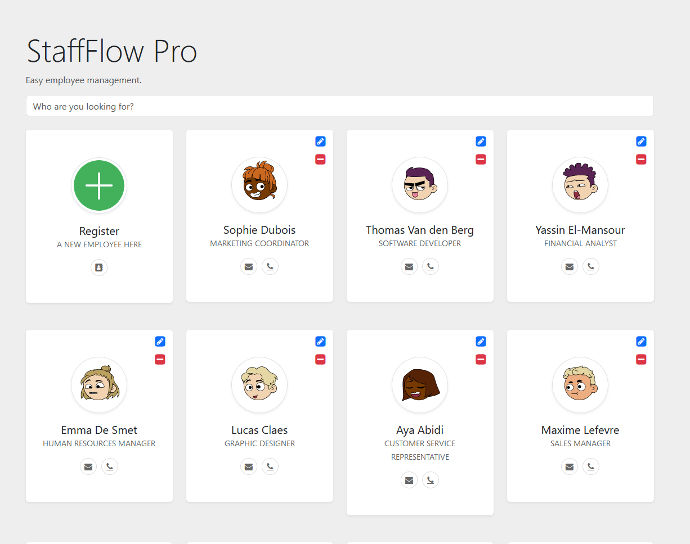

# Staffflow Pro

Staffflow Pro is a simple employee management application showcasing the use of Java Spring (backend) and Angular (frontend).

## Table of Contents

- [Overview](#overview)
- [Technologies](#technologies)
- [Getting Started](#getting-started)
- [Backend](#backend)
- [Frontend](#frontend)
- [Testing](#testing)
- [Contributing](#contributing)
- [License](#license)

## Overview

This application allows you to manage employees, performing basic CRUD operations (Create, Read, Update, Delete). It serves as a demonstration of my proficiency in Java Spring and Angular technologies.

## Technologies

- **Backend:**

  - Java Spring
  - Spring Boot
  - Spring Data JPA

- **Frontend:**
  - Angular

## Getting Started

To run the application locally, follow these steps:

1. **Clone the repositories:**

   ```bash
   git clone https://github.com/sbstnlambert/staffflow-pro-backend.git
   cd staffflow-pro-backend
   ```

   @ [Backend Repository](https://github.com/sbstnlambert/staffflow-pro-backend)

   ```bash
   git clone https://github.com/sbstnlambert/staffflow-pro-frontend.git
   cd staffflow-pro-frontend
   ```

   @ [Frontend Repository](https://github.com/sbstnlambert/staffflow-pro-frontend)

2. **Backend Setup:**

   - Open the **`staffflow-pro-backend/`**` directory in your preferred Java IDE.
   - Run the **`StaffflowProApplication.java`** file.

3. **Frontend Setup:**

   - Open a new terminal in the **`staffflow-pro-frontend/`** directory.
   - Run the following commands:

   ```bash
   npm install
   ng serve
   ```

4. **Access the application:**
   - Open your web browser and go to [http://localhost:4200](#http://localhost:4200).

## Backend Structure

The backend of the application is built using Java Spring. Here are some key files:

- **`StaffflowProApplication.java`**: Entry point of the application.
- **`EmployeeController.java`**: Handles HTTP requests related to employees.
- **`EmployeeService.java`**: Contains business logic for employee management.
- **`Employee.java`**: Represents the Employee entity.

## Frontend Structure

The frontend of the application is built using Angular. Key files include:

- `src/`: Contains the source code for the frontend application.
- `app/`: Components, services, and other application-specific elements.
- `assets/`: Static resources such as images.
- `environments/`: Configuration files for different environments.
- `styles.css`: Global styles for the application.

## Testing

### Backend

Unit tests are provided to ensure the robustness of the application. To run tests, use your preferred testing tool or run:

```bash
mvn test
```

### Frontend

Unit tests for the `EmployeeService` are provided in `employee.service.spec.ts`. These tests ensure that the service behaves as expected when interacting with the backend API. To run tests, use your preferred testing tool or run:

```bash
ng test
```

## License

This project is licensed under the MIT License - see the [LICENSE](./LICENSE) file for details.

The MIT License is a permissive open source license that allows for unlimited rights to use, copy, modify, merge, publish, distribute, sublicense, and/or sell copies of the software. It is a simple and easy-to-understand license that is friendly to both individuals and businesses.

You can find a copy of the MIT License in the [LICENSE](./LICENSE) file included with this project.
